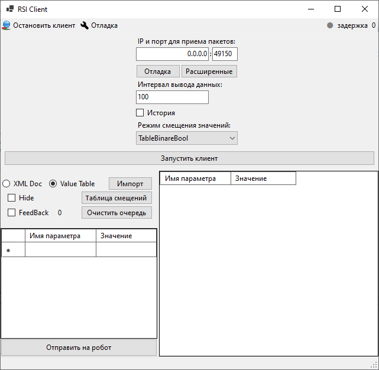

# RSIClient

## Описание Windows Forms клиента
Данный графический клиент разработан для интеграции и управления роботами KUKA с использованием интерфейса RSI и .NET C#. Клиент позволит отладить ваше решение для интеграции и управления роботами, позволяя обеспечить высокую степень автоматизации на производственных процессах.

### Клиент умеет:
- Принимать данные с указанного IP-адреса и порта.
- Изменять принятые данные и отправлять их обратно роботу.
- Отправлять другие пользовательские теги с возможностью гарантированной перезаписи (FeedBack).

### Основные функции
- **Подключение к роботу**: Клиент поддерживает асинхронные операции, позволяя установить соединение с роботом и обмениваться данными в реальном времени.
- **Интерфейс для взаимодействия**: графический интерфейс, который включает в себя элементы управления для ввода IP и порта, настройки параметров обмена данных, а также возможность просмотра и редактирования полученных данных.
- **Отладка и логирование**: Встроенные инструменты для отладки и мониторинга состояния соединения с роботом, включая временные метки и статус подключения.

### Используемые технологии
- .NET 8.0
- Протокол RSI для взаимодействия с роботами KUKA
- Windows Forms для создания пользовательского интерфейса (при желании, проект можно переделать в WPF)

### Примеры использования
Клиент может быть использован для различных задач, связанных с автоматизацей перемещения робота.
Для получения дополнительной информации и доступа к коду клиентского приложения, посетите следующие репозитории:
- [RSISensorNET](https://github.com/Svyatogor3757/RSISensorNET)
- [KUKA.RSI](https://github.com/Svyatogor3757/KUKA.RSI)

